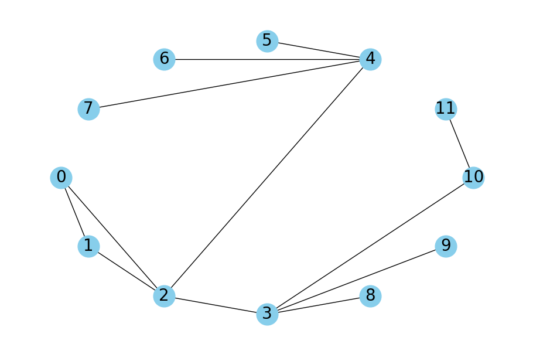

# Graph Traversal and Visualization

This repository contains a Python implementation of graph traversal algorithms: Depth-First Search (DFS) and Breadth-First Search (BFS), along with graph visualization capabilities using `networkx` and `matplotlib`.

## Description

The `Graph` class within the `graph.py` script provides methods to:
- Add edges to the graph
- Perform DFS traversal from a given starting vertex
- Perform BFS traversal from a given starting vertex
- Visualize the graph with labeled nodes and edges

## Features

- **DFS**: A recursive algorithm that visits all vertices of a graph in the depthward motion using backtracking.
- **BFS**: An iterative algorithm that visits all vertices in breadthward motion using a queue.
- **Visualization**: Illustration of the graph using `networkx`'s drawing capabilities and `matplotlib`.

## Complexity
Both DFS and BFS have a time complexity of \( O(V + E) \) where \( V \) is the number of vertices and \( E \) is the number of edges in the graph. The space complexity for both algorithms is \( O(V) \) to store the visited vertices.

## Usage

To use the `Graph` class:

1. Create an instance of the `Graph` class.
2. Use `add_edge(u, v)` method to add edges between two vertices.
3. Call `dfs(start)` to perform Depth-First Search from the `start` vertex.
4. Call `bfs(start)` to perform Breadth-First Search from the `start` vertex.
5. Call `visualize()` to display the graph.

Example:
```python
g = Graph()
g.add_edge(0, 1)
g.add_edge(0, 2)
# ... add all edges

print("DFS starting from vertex 2:")
g.dfs(2)

print("BFS starting from vertex 2:")
g.bfs(2)

g.visualize()
```

## Requirements

This project requires the following Python libraries:

- `networkx`
- `matplotlib`

You can install these packages using `pip` with the following command:

```sh
pip install networkx matplotlib
```

## Visualization Example

Below is an example of how the graph looks when visualized using the provided code:


