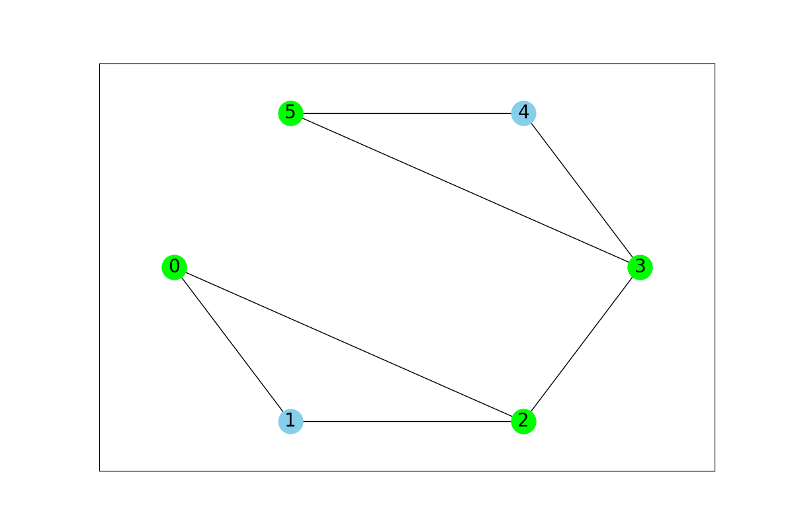

# Shortest Path Finder in Unweighted Graph

This repository contains a Python implementation for finding the shortest path in an unweighted graph using the Breadth-First Search (BFS) algorithm.

## Description

The provided Python script defines a `Graph` class that can be used to create an unweighted graph and find the shortest path between two nodes.

## Features

- **Unweighted Graph Representation**: The graph is represented in a way that is suitable for unweighted and undirected graphs.
- **Shortest Path Calculation**: Utilizes BFS to find the shortest path between two nodes in the graph.
- **Optimal Time Complexity**: With a time complexity of \( O(V + E) \), where \( V \) is the number of vertices and \( E \) is the number of edges, the algorithm is efficient for large graphs.

## Visualization

The script also includes graph visualization capabilities:

- Nodes and edges of the graph are displayed with labeled vertices.
- The shortest path found by the `shortest_path` method, if provided, is highlighted in the visualization.

To visualize the graph and the shortest path, call the `visualize` method with the path as an argument:
```python
path = g.shortest_path(start_node, end_node)
g.visualize(path=path)
```

## Usage

To use the `Graph` class:

1. Instantiate the `Graph` class.
2. Use `add_edge(u, v)` to add edges between two nodes.
3. Call `shortest_path(start, end)` to find the shortest path between `start` and `end` nodes.


Remember to install `networkx` and `matplotlib` to run the visualization:

```bash
pip install networkx matplotlib
```

## Visualization Example

Below is an example of how the graph looks when visualized using the provided code after the shortest path calculation:


